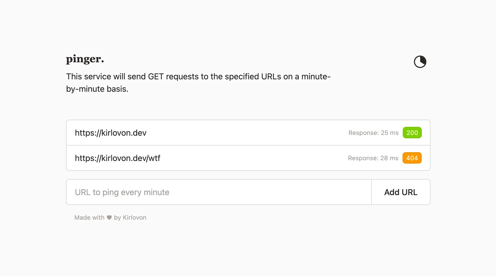

# Pinger

A lightweight SvelteKit application that monitors URLs by periodically pinging them and tracking their response times and status codes in real-time.

## Features

- **Automated Monitoring**: Pings all registered URLs every 5 seconds
- **Response Tracking**: Records status codes and response times
- **Real-time Updates**: Live dashboard with server-sent events
- **SQLite Storage**: Persistent data using Prisma ORM
- **Optional Auth**: HTTP Basic Authentication support
- **Modern Stack**: Built with SvelteKit 2, Svelte 5 (runes), and Tailwind CSS 4

## Quick Start

### Prerequisites

- Node.js 18+ 
- npm/pnpm/yarn

### Installation

```sh
# Install dependencies
npm install

# Initialize database
npx prisma migrate dev

# Start development server
npm run dev
```

Visit `http://localhost:5173` to access the application.

## Configuration

### Environment Variables

Create a `.env` file in the project root (optional):

```env
# SQLite Database URL
DATABASE_URL="file:./data.db"

# Optional HTTP Basic Authentication
ACCESS_USERNAME=admin
ACCESS_PASSWORD=secret
```

### Ping Interval

Modify the ping interval in `src/lib/config.ts`:

```typescript
export const PING_INTERVAL = 5000; // milliseconds
```

## Development

```sh
npm run dev              # Start dev server
npm run build            # Production build
npm run preview          # Preview production build
npm test                 # Run tests
npx prisma studio        # Visual database browser
npx prisma migrate dev   # Create database migrations
```

## License

MIT
