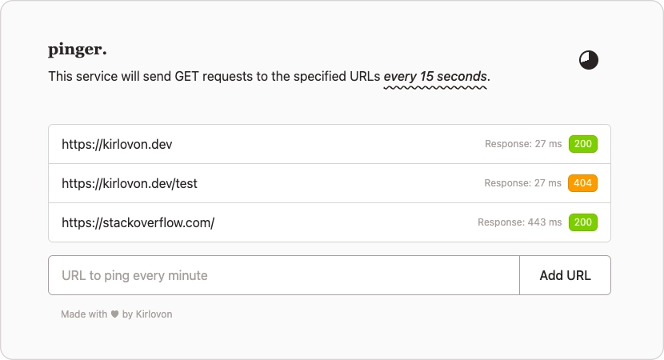

<p align="center">
  
</p>


# Pinger
A lightweight, self-hosted service for URL pinging that periodically pings any URLs you add and records their latest HTTP status code and response latency.

**Use cases:**
- Keep serverless functions warm by hitting them periodically
- Track response time trends for performance insights

**Stack:** SvelteKit 2, Svelte 5 (runes), Prisma 7, SQLite (via Better-SQLite3 adapter), Tailwind CSS 4

<br/>

## Quick Start

1. Create `.env` file:

```env
DATABASE_URL="file:./data/data.db"
```

You can specify `ACCESS_USERNAME` and `ACCESS_PASSWORD` for optional HTTP Basic Authentication:

```
ACCESS_USERNAME="admin"
ACCESS_PASSWORD="secret'
```

2. Install dependencies and start:

```sh
npm install
npx prisma migrate dev
npm run dev
```

Open http://localhost:5173

<br/>

## Configuration

Adjust ping interval in `src/lib/config.ts`:

```typescript
export const PING_INTERVAL = 15_000;
export const REQUEST_TIMEOUT = 500;
```

<br/>

## Commands

```sh
npm run dev              # Development server
npm run build            # Production build
npm start                # Run production build
npm test                 # Tests
npx prisma studio        # Database browser
npx prisma migrate dev   # Create migrations
```

<br/>

## Docker

Docker Compose is the easiest way to run Pinger with persistent storage. The SQLite database is stored in `./data/data.db` on your host machine and survives container restarts.

Create a `.env` file first (see Quick Start section), then:

```sh
# Start in background
docker compose up -d

# View logs
docker compose logs -f

# Stop
docker compose down
```

For manual runs, bind-mount the data directory:

```sh
# Build and run with data persistence
docker build -t pinger .
docker run -p 3000:3000 -v $(pwd)/data:/app/data pinger

# With HTTP Basic Auth (recommended for public exposure)
docker run -p 3000:3000 \
  -v $(pwd)/data:/app/data \
  -e ACCESS_USERNAME=admin \
  -e ACCESS_PASSWORD=secret \
  pinger
```

> Enable auth in `docker-compose.yml` by uncommenting the environment variables, then run `docker compose restart`.

<br/>

## License

MIT
